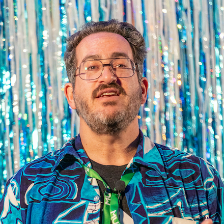

To quote
[24601](https://www.youtube.com/watch?v=TrPCWfB-Jdo){:rel="nofollow" target="_new"},
who am I?

{:class="about-me-pic img-responsive"}
{:class="center"}

I am Dave Aronson,
a semi-retired software development consultant.&nbsp;
(See
[my Codosaurus site](https://www.codosaur.us/){:target="_new"}
for details on that.)

You can see
[How I Met Your Mother, er, I mean, Mead](/2020/01/01/how-i-met-mead.html)
for my background with mead.

On other notes,
I am married to a smart cutie who doesn't like publicity,
so no more details there.&nbsp;
We live in
[City of Fairfax, VA](https://www.google.com/maps/place/Fairfax,+Virginia/){:rel="nofollow" target="_new"}
(a suburb of Washington, DC),
and are owned by two cats, Nina and Petey.&nbsp;
(I believe in the Oxford Comma,
so that's two cats _who are_ Nina and Petey,
not two cats _plus_ Nina and Petey.)
