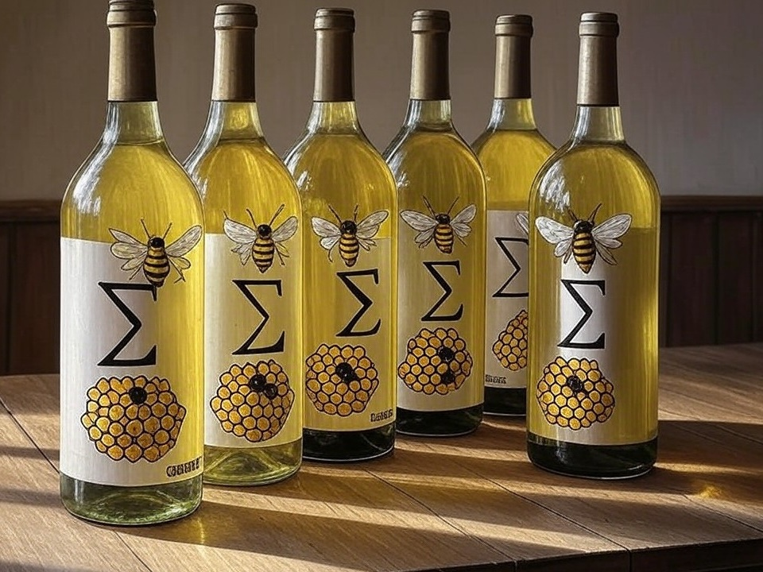

---
# Feel free to add content and custom Front Matter to this file.
# To modify the layout, see https://jekyllrb.com/docs/themes/#overriding-theme-defaults

layout: default
title: Home
---

<h3>Welcome to <i>Sum of a Batch!</i></h3>

{:class="centered" style="border-radius: 4em"}

This site is about making
[mead](https://en.wikipedia.org/wiki/Mead){:rel="nofollow" target="_new"},
a wine-like drink
made by fermenting _honey_ rather than _fruit_.&nbsp;
Most people
(at least Americans)
associate it with the Vikings --
but actually,
it was around for about 8,000 years before them!&nbsp;
It was made _everywhere_ that people had honey --
all over not only Europe,
but also Africa and Asia
(including some Pacific islands, at least the Philippines),
and even Central America!

Site Contents:
- 🥃 [Simple Recipe](simple_recipe)
- ❌ [Mead Myths BUSTED!](myths)
- 🧮 [Calculators](calculators)
- 💡 [Advice](advice)
- ⏯️ [Videos](videos) coming eventually, for now just a list of what's planned
- 🏫 [Workshops](workshops) coming eventually, for now just a concept outline
- 📔 [Blog](blog)
- ❓ [About](about)
- 🔗 [Links](links) to useful stuff elsewhere
- 🙇🏻 [Credits](credits)

### IMPORTANT LEGAL NOTE:

**I do not _sell alcohol_.**&nbsp;
Nor do I give it away, as part of this business.&nbsp;
Not one drop, no way no how,
in any manner that could possibly be construed as selling,
or even risking giving any to a minor.&nbsp;
The laws on selling alcohol are just too complex and expensive
for me to bother even _trying_ to comply with,
and the penalties aren't worth the likely profits.&nbsp;
(And distilling is Right Out.)
{:class="small"}

What I _am_ giving away here on this website,
is the _knowledge_
for _you_ to _make your own_.&nbsp;
What I am selling in the workshops
is that knowledge plus the _equipment and ingredients_,
which consists mostly of things that anybody could easily buy
at their local grocery store.
{:class="small"}

Any responsibility for:
{:class="small"}
- the transfer of _your_ alcohol to any other party;
- what _you_ or any other party do after drinking;
- _your_ possession, drinking, or making of alcohol
at your age and in your jurisdiction;
- and any other consequences of following the advice herein;
{:class="small"}

is _entirely on you_.
{:class="small"}
